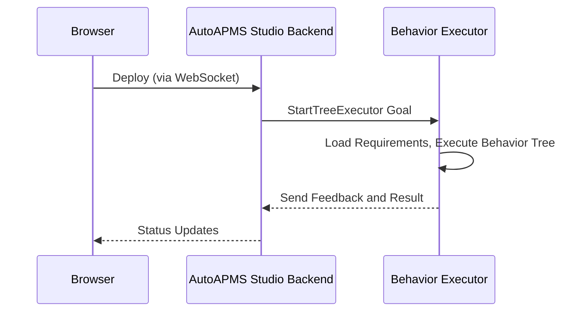

# Workflows

AutoAPMS Studio is a powerful tool for creating and deploying Behavior Trees. Workflows include but are not limited to:
- Creating new Behavior Trees
- Importing and Exporting existing Behavior Trees
- Deploying Behavior Trees to your robot or drone

If you just want to get started with Behavior Trees, see the [Quickstart Guide](../introduction/getting-started.md). 
Read along if you want to learn more in-depth about the concepts behind AutoAPMS Studio.

## Importing & Exporting

AutoAPMS Studio uses the standard **BehaviorTree.CPP v4 XML format** for importing and exporting. 
This ensures compatibility with other tools using the same format, allowing you to easily move trees between them.
If you want to find out more about the format itself, see [XML Format](../reference/xml-format.md).

### Importing a Behavior Tree

1. Press the **Import** button in the **Sidebar** footer
2. Select your `.xml` file
3. The Behavior Trees from the file will then be loaded into your current workspace

::: warning
Importing a file will replace your current workspace. Make sure to export your current work first if needed.
:::

### Exporting a Behavior Tree

AutoAPMS Studio supports two export options:

**Export the default Behavior Tree**

This will export the Behavior Tree that is currently set as the default in the **Sidebar**. The export includes
the main tree alongside all Sub-Trees.

1. Click the **Export** button in the **Sidebar** footer
2. Save the file, e.g. as `my_workspace.xml`

**Export a particular Behavior Tree**

1. Right-click the Behavior Tree in the **Tree Explorer**
2. Select **Export Behavior Tree**
3. Save the file, e.g. as `my_behavior_tree.xml`

## Offline Mode

You can use AutoAPMS Studio without an active connection to the AutoAPMS Studio Backend.

### How it works

The AutoAPMS Studio Frontend includes a built-in default set of nodes that can be used without an active connection to the Backend.
If you are connected to the Backend, you can head to the Settings page and download the currently indexed node models from the Backend.
You can then replace the default node model list file with the downloaded version to feature your own custom nodes.

### Limitations

In offline mode, you are unable to use the **Deploy** feature as this requires a connection to the Backend.
Your node models will also not be updated automatically, instead you will need to download them manually.

For full functionality, use the AutoAPMS Studio Web App alongisde the Backend. For more details, see the [Installation Guide](../introduction/installation.md).

In offline mode, the following features are unavailable:

## Deploy

AutoAPMS Studio allows you to deploy Behavior Trees directly to your robot or drone. 
The default Behavior Tree, alongside required Sub-Trees, is sent as an XML file to 
the Backend to a running [AutoAPMS Behavior Executor](https://autoapms.github.io/auto-apms-guide/concept/behavior-executor), 
which loads the required node plugins and executes the tree.

### How it works

After connecting to the Backend and pressing **Deploy**, the AutoAPMS Studio Frontend
connects via a WebSocket to the Backend and sends the current default Behavior Tree alongside required Sub-Trees
and your defined Node Manifest to the **Behavior Executor** running on the Backend System. The Executor
then loads the node plugins defined in the Node Manifest and executes the tree.



**Behavior Executor**

The Behavior Executor is a ROS 2 Node that receives the Behavior Tree and executes it. 
It exposes a ROS 2 Action interface for the Backend to connect to. 
AutoAPMS provides the standard executor `tree_executor` out of the box.

**Node Manifest**

The Node Manifest tells the executor which node plugins to load before running the tree. 
It is specified as a comma-separated list of Node Manifest identities, e.g. `fosdem26_autoapms_behavior::wave_right`. 
Without a manifest, the executor does not know how to resolve custom nodes used in the tree.

For more details on Node Manifests and the Executor, see the [AutoAPMS documentation](https://autoapms.github.io/auto-apms-guide/concept/common-resources#behavior-tree-node-manifests).

### Prerequisites

To ensure a smooth deployment process, AutoAPMS Studio requires the following to be running on your system:


**1. AutoAPMS Studio Backend**

The backend must be started manually:

```bash
source install/setup.bash
ros2 run auto_apms_studio start_backend
```

For more details on how to install and run the Backend, see the [Installation Guide](../introduction/installation.md).

**2. A Behavior Executor**

A Behavior Executor must be running and ready to accept trees. The standard executor provided by AutoAPMS can be started with:

```bash
ros2 run auto_apms_behavior_tree tree_executor
```

### Deployment Steps

1. Switch to **Deploy Mode** using the **Sidebar Mode Switcher** in the top left of the sidebar
2. Enter the **Node Manifest** identity, e.g. `fosdem26_autoapms_behavior::wave_right`
3. Click **Deploy** to send the Behavior Tree to the executor

::: tip
You can connect to a remote Backend from any machine on the same network, not just locally. 
This allows you to deploy directly from your development machine to your robot. For remote deployments,
please ensure that the Backend is only accessible from trusted devices. (e.g., through a VPN or network tunnel)
:::