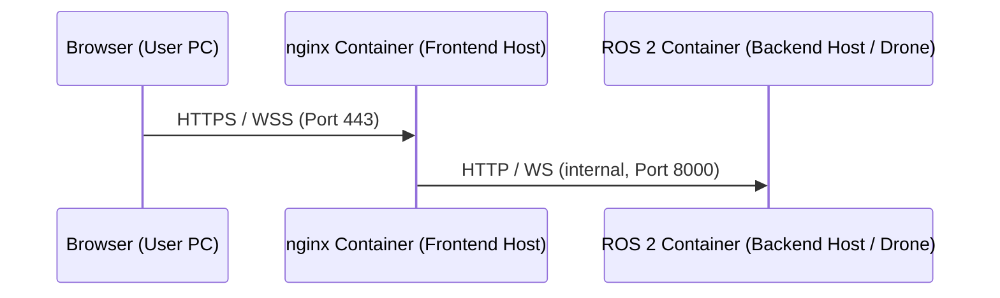

# Installation

AutoAPMS Studio is available as a **ROS 2 package** or as a **standalone web editor**. 
We recommend installing AutoAPMS Studio in a ROS 2 environment along with [AutoAPMS](https://autoapms.github.io/auto-apms-guide/).

<div class="custom-block tip" style="padding: 8px 12px;">  
  <p style="margin: 0;">Just want to try it out? View the <a href="https://auto-apms-studio-d50829.pages.git-ce.rwth-aachen.de/">Live Demo</a>!</p>
</div>

### Prerequisites

|                                                                                            | Development           | Production                           |
|--------------------------------------------------------------------------------------------|-----------------------|--------------------------------------|
| OS                                                                                         | Linux (Ubuntu 22.04+) | Linux (Ubuntu 22.04 LTS recommended) |
| Node.js & npm ([Guide](https://docs.npmjs.com/downloading-and-installing-node-js-and-npm)) | ✓                     | ✓                                    |
| ROS 2 Jazzy ([Guide](https://docs.ros.org/en/jazzy/Installation.html))                     | ✓ ¹                   | ✓ (Backend Host)                     | 
| Docker                                                                                     | —                     | ✓ (Both Hosts)                       |
| mkcert                                                                                     | —                     | ✓ (Frontend Host)                    |

*¹ Only required for the [ROS 2 package installation](#ros2-package), not for the [standalone web editor](#standalone).*

## Development

<a id="ros2-package"></a>
###  Install as a ROS 2 package <br>
This installation method is recommended. 
It includes full functionality including automatic node model loading from the AutoAPMS Framework.

#### 1. Install Dependencies
```bash
source /opt/ros/jazzy/setup.bash # Adjust to your ROS 2 distribution
sudo apt update
sudo apt install ros-$ROS_DISTRO-auto-apms-*
```

#### 2. Clone the Repository
Create a ROS 2 workspace (follow this [guide](https://docs.ros.org/en/jazzy/Tutorials/Beginner-Client-Libraries/Creating-A-Workspace/Creating-A-Workspace.html)) and clone the AutoAPMS Studio repository into it:
```bash
mkdir -p ~/ros2_ws/src
cd ~/ros2_ws/src
git clone https://github.com/AutoAPMS/auto_apms_studio
```

#### 3. Build the Package
```bash
cd ~/ros2_ws
colcon build --packages-select auto_apms_studio
source install/setup.bash
```

#### 4. Launch
**Option A: Launch the Frontend and Backend together**
```bash
source install/setup.bash # Required if not currently sourced
ros2 launch auto_apms_studio studio_launch.py
```

**Option B: Launch Frontend and Backend separately**
```bash
# Terminal 1: Backend
ros2 run auto_apms_studio start_backend --host 0.0.0.0 --port 8000

# Terminal 2: Frontend
ros2 run auto_apms_studio start_web --host 0.0.0.0 --port 5173
```

**Accessing the Web Editor**
After launching, open your browser and navigate to: <br> `http://localhost:5173/auto_apms_studio/`.
Adjust the host and port parameters to match your setup.
 
---

<a id="standalone"></a>
###  Standalone Installation

For quick prototyping, or on-the-fly Behavior Tree editing without a ROS 2 environment. Limited to cached node models.

#### 1. Clone and Install

```bash
git clone https://github.com/AutoAPMS/auto_apms_studio
cd auto_apms_studio/web
npm install
```

#### 2. Start Web Server

```bash
npm run dev
```

#### 3. Access Web Editor

Open your browser and navigate to `http://localhost:5173/auto_apms_studio/`.
Adjust the host and port parameters to match your setup.

::: warning Limited Functionality
The standalone web-editor installation works **without a backend**. Cached node models from previous backend connections are used, or the built-in default nodes if no cache exists
  For the best experience, install AutoAPMS Studio in a ROS 2 environment along [AutoAPMS](https://github.com/AutoAPMS/auto-apms).
  :::

## Production

For production deployments, e.g., on a on-board drone computer with a separate frontend machine, AutoAPMS Studio is deployed using Docker containers.
This separates the fronteng (nginx) fro mthe backend (ROS 2) across two machines.



### 1. SSL Certificate Setup (Frontend Host, one time setup)
For more information view the [mkcert](https://github.com/FiloSottile/mkcert) documentation.

```bash
# Install mkcert
sudo apt install -y libnss3-tools
curl -JLO "https://dl.filippo.io/mkcert/latest?for=linux/amd64"
chmod +x mkcert-v*-linux-amd64
sudo cp mkcert-v*-linux-amd64 /usr/local/bin/mkcert
 
# Install local CA
mkcert -install
 
# Generate certificate for your IP
cd ~/auto_apms_studio/web 
mkdir -p certs
mkcert <FRONTEND_IP> localhost 127.0.0.1
 
# Rename to expected filenames
mv <FRONTEND_IP>+2.pem certs/cert.crt
mv <FRONTEND_IP>+2-key.pem certs/cert.key
```

> **Note:** The certificate files are expected to be named `cert.crt` and `cert.key`. Find your IP with:
> `ip addr show | grep "inet " | grep -v 127.0.0.1 | grep -v 172.17`

To trust the certificate on client devices (User PC), copy `certs/cert.crt` to the client and install it:

::: details Optional: Trust the certificate on client devices
To avoid the browser warning, install the CA certificate on the client device:

:::: tabs
=== Ubuntu / Debian
```bash
sudo cp cert.crt /usr/local/share/ca-certificates/
sudo update-ca-certificates
```
=== macOS
```bash
sudo security add-trusted-cert -d -r trustRoot \
  -k /Library/Keychains/System.keychain cert.crt
```
=== Windows
```powershell
# Run PowerShell as Administrator
Import-Certificate -FilePath "cert.crt" -CertStoreLocation Cert:\LocalMachine\Root
```
::::

---

### 2. Frontend: Build Docker Image

```bash
cd ~/auto_apms_studio/web 
docker build -t auto-apms-studio-web .
```

The following environment variables can be overridden at runtime:

| Variable                        | Default          | Description                           |
|---------------------------------|------------------|---------------------------------------|
| `AUTO_APMS_STUDIO_BACKEND_HOST` | `127.0.0.1`      | IP of the Backend Host                |
| `AUTO_APMS_STUDIO_BACKEND_PORT` | `8000`           | Port of the Backend Host              |
| `ALLOWED_NETWORK`               | `192.168.0.0/24` | Subnet allowed to access the Frontend |

> `192.168.0.0/24` covers the most common home network range (`192.168.0.1` – `192.168.0.254`). Override it if your network differs (e.g. `10.0.0.0/24`).

---

### 3. Frontend: Start Container

**Without SSL (local testing only)**

```bash
cd ~/auto_apms_studio/web 
 
docker run -d -p 80:80 \
  -e AUTO_APMS_STUDIO_BACKEND_HOST=<BACKEND_IP> \
  -e AUTO_APMS_STUDIO_BACKEND_PORT=8000 \
  -e ALLOWED_NETWORK=192.168.0.0/24 \
  auto-apms-studio-web
```
Access via: `http://localhost/auto_apms_studio/`

**With SSL (recommended)**

```bash
cd ~/auto_apms_studio/web 
 
docker run -d -p 80:80 -p 443:443 \
  -e AUTO_APMS_STUDIO_BACKEND_HOST=<BACKEND_IP> \
  -e AUTO_APMS_STUDIO_BACKEND_PORT=8000 \
  -e ALLOWED_NETWORK=192.168.0.0/24 \
  -v $(pwd)/certs:/etc/nginx/certs:ro \
  -v $(pwd)/nginx.ssl.conf.template:/etc/nginx/templates/default.conf.template \
  auto-apms-studio-web
```

Access via: `https://localhost/auto_apms_studio/`

> Replace `<BACKEND_IP>` with the IP of the Backend Host. When both containers run on the same machine, use `172.17.0.1` (Docker bridge).  
> Replace `192.168.0.0/24` with your local network subnet. To find it: `ip addr show | grep "inet " | grep -v 127.0.0.1 | grep -v 172.17`
 
---

### 4. Backend: Start

```bash
# Build (after code changes / updates)
cd /ros2_ws
colcon build --packages-select auto_apms_studio
source install/setup.bash
 
# Start without API Key (no authentication)
ros2 run auto_apms_studio start_backend
 
# Start with API Key (recommended)
export API_KEY=your-secret-key
ros2 run auto_apms_studio start_backend
```

To make the API Key permanent, add it to `~/.bashrc`:

```bash
echo 'export API_KEY=your-secret-key' >> ~/.bashrc
source ~/.bashrc
```

---

### 5. Connect via the UI

Open the frontend in your browser and enter:

| Field  | Value             | Description                      |
|--------|-------------------|----------------------------------|
| IP     | `<FRONTEND_IP>`   | IP of Frontend Host              |
| PORT   | `443`             | HTTPS port (or `80` without SSL) |
| KEY    | `your-secret-key` | API Key (leave empty if not set) |

> If accessing from the same PC the frontend runs on, use `localhost` as IP.

Click **CONNECT**. The status indicator turns blue while connecting and green when connected.

---

### 6. Backend Firewall 

By default, port `8000` on PC 2 is accessible to anyone on the network, bypassing nginx entirely. To restrict access to the Frontend Host only:

```bash
sudo apt install -y ufw
sudo ufw allow from <PC1_IP> to any port 8000
sudo ufw deny 8000
sudo ufw enable
sudo ufw status
```

> Replace `<PC1_IP>` with the actual IP of PC 1 (Frontend Host).

This enforces two independent security layers on the backend:

| Layer | Mechanism                                                      |
|-------|----------------------------------------------------------------|
| 1     | Firewall: only Frontend Host can reach port 8000               |
| 2     | API Key: every WebSocket connection must provide a valid token |

---

### Production Security Overview

| Mechanism        | Description                                                             |
|------------------|-------------------------------------------------------------------------|
| HTTPS/WSS        | All traffic encrypted via TLS 1.3                                       |
| API Key          | Backend rejects connections with invalid or missing token               |
| IP Whitelist     | Only `ALLOWED_NETWORK` subnet can access the frontend                   |
| Rate Limiting    | Max 10 requests/minute per IP, burst 5                                  |
| Connection Limit | Max 5 concurrent connections per IP                                     |
| Security Headers | X-Frame-Options, HSTS, XSS protection, Content-Type sniffing prevention |
| WebSocket Size   | Max 1MB per message (backend)                                           |
| Backend Firewall | Only Frontend Host PC can reach port 8000 on Backend Host PC            |
